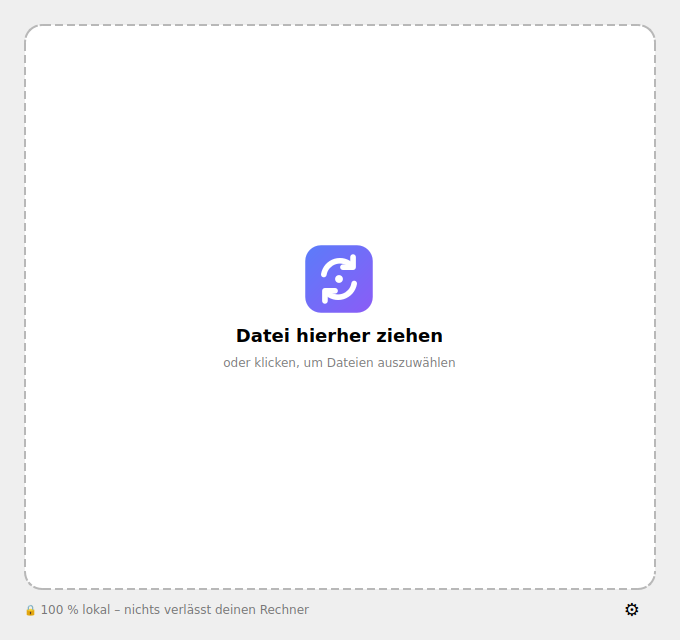
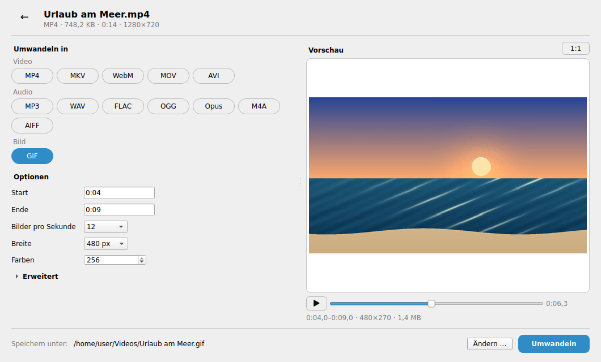
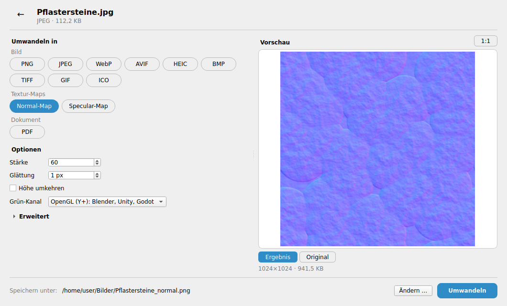
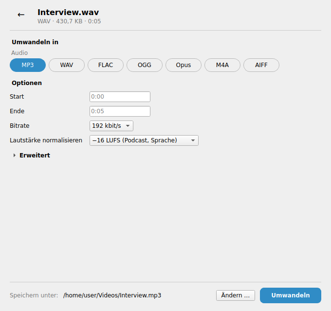

# OmniConverter

**Ein Werkzeug für alles:** Videos, Musik, Bilder, 3D-Modelle, Dokumente, Tabellen und Daten
umwandeln, dazu QR-Codes, Normal-/Specular-Maps und Noise-Maps erzeugen – mit einer einzigen,
simplen Oberfläche. Datei reinziehen, Zielformat klicken, fertig. Alles läuft **lokal auf
deinem Rechner**, ohne Uploads und ohne Telemetrie.

<p align="center">
  
  
</p>
<p align="center">
  
  
</p>

Statt Handbrake für Videos, Audacity für Musik, GIMP für Bilder und Office für Dokumente gibt
es ein Fenster, das sich an die Datei anpasst: Nach dem Drop zeigt OmniConverter nur die
Zielformate, die für diese Datei sinnvoll sind, und nur die Optionen, die für die gewählte
Umwandlung gelten. Eine **Live-Vorschau** daneben zeigt das Ergebnis, bevor es gespeichert
wird. Ohne Speicherort landet das Ergebnis neben dem Original, mit neuer Endung. Vorhandene
Dateien werden nie überschrieben (`Urlaub (1).mp4`).

## Was geht?

| Quelle | Ziele | Extras |
|---|---|---|
| **Video**: mp4, mkv, webm, mov, avi, wmv, flv, mpg, ts/m2ts, 3gp, ogv | mp4, mkv, webm, mov, avi, **gif**, alle Audioformate | Schneiden, Auflösung, Qualität, FPS, Ton entfernen, verlustfreies Umpacken, Lautheit normalisieren, Metadaten entfernen |
| **GIF-Export** | gif | Schneiden, FPS, Breite, Farbanzahl, Dithering, Wiederholung (optimierte Palette) |
| **Animiertes GIF** | **webm**, mp4, mkv, mov, avi | **Transparenz bleibt in WebM erhalten** (VP9 mit Alphakanal), Schneiden, Auflösung, Qualität, FPS |
| **Audio**: mp3, wav, flac, ogg, opus, m4a, aac, aiff, wma | mp3, wav, flac, ogg, opus, m4a, aiff | **Lautheit normalisieren (EBU R128, zwei Durchläufe)**, Bitrate, Abtastrate, Mono/Stereo, Ein-/Ausblenden, Schneiden, Cover bleibt erhalten |
| **Bild**: png, jpg, webp, avif, heic, bmp, tiff, gif, ico, tga | png, jpg, webp, avif, heic, bmp, tiff, gif, ico, **pdf** | Größe ändern, Qualität, verlustfrei, **PNG mit weniger Farben** (256 … 2, mit Dithering, deutlich kleiner), EXIF/GPS entfernen, Drehung laut EXIF, Hintergrund für Transparenz, Animationen bleiben erhalten |
| **Textur**: jedes Bild oben | **Normal-Map**, **Specular-Map** (PNG, z. B. `stein_normal.png`) | Stärke, Glättung, Höhe umkehren, OpenGL/DirectX, nahtlos kachelbar; Specular mit Helligkeit/Kontrast, umgekehrt als Roughness-Map |
| **3D-Modell**: obj, glb, gltf, fbx, stl, ply | obj, glb, gltf, fbx, stl, ply | Skalierung (cm/m/mm/Zoll), Oben-Achse Y↔Z, OBJ mit `.mtl` und Texturen, glTF als eine Datei; FBX über Blender (Animationen bleiben bei FBX ↔ GLB erhalten) |
| **QR-Code**: Link oder Text (eintippen, einfügen oder reinziehen), txt, md, vCard (vcf), Verknüpfungen (url, webloc) | PNG, SVG | Fehlerkorrektur, Größe, Farben, transparenter Hintergrund. Aus Dateien wird der Inhalt kodiert (bis ca. 2,9 KB), aus Verknüpfungen die Adresse |
| **Noise-Map** (ohne Quelldatei) | png, jpg, webp, bmp, tiff | **Seed** (gleicher Seed = gleiches Bild, 🎲 würfelt), Wolken, Perlin, Gebirge, Zellen, weißes Rauschen, Größe, Strukturgröße, Detailstufen, nahtlos kachelbar, Farbverlauf |
| **Dokument**: md, html, docx, odt, epub, rst, tex, rtf, txt, doc | pdf, docx, odt, rtf, txt, md, html, epub, tex | Markdown → PDF über Pandoc + LibreOffice |
| **Tabelle**: xlsx, xls, ods, csv, tsv | xlsx, ods, csv, tsv, pdf, json, yaml, toml | Trennzeichen erkennen, Excel-kompatibles CSV, Tabellenblatt wählen |
| **Präsentation**: pptx, ppt, odp | pdf, pptx, odp | |
| **Daten**: json, yaml, toml | untereinander sowie csv, tsv, xlsx | verschachtelte Daten werden zu Spalten wie `user.name` |

Mehrere Dateien auf einmal (Drag & Drop oder Mehrfachauswahl im Kontextmenü) werden
nacheinander umgewandelt, z. B. MP3, WAV und FLAC gemeinsam nach Opus. Angeboten werden dann
nur die Zielformate, die für alle Dateien passen.

QR-Codes und Noise-Maps brauchen keine Datei: Auf der Startseite gibt es ein Feld für Link oder
Text (Strg+V oder ein Link aus dem Browser tun es auch) und den Knopf „Noise-Map erzeugen“.
Die Ergebnisse landen im Bilder-Ordner, z. B. als `qr-code.png` oder `noise-42.png`.

## Datenschutz

* OmniConverter selbst baut **keine Netzwerkverbindung** auf: keine Telemetrie, keine
  Update-Abfrage, kein Online-Dienst. Die Tests prüfen das automatisch.
* Auch externe Programme werden abgeschottet. FFmpeg darf nur lokale Dateien öffnen
  (`-protocol_whitelist file,pipe`), damit eine Playlist nichts aus dem Internet nachlädt.
  Pandoc läuft mit `--sandbox`, zusätzlich wird sein Netzwerkzugriff auf einen toten Proxy
  umgeleitet. LibreOffice startet mit einem eigenen, temporären Profil und hinterlässt
  keinen Verlauf. Blender läuft mit Werkseinstellungen (`--factory-startup`), ohne eigene
  Add-ons und ebenfalls mit einem temporären Profil. 3D-Modelle dürfen nur Dateien aus
  ihrem eigenen Ordner nachladen, z. B. Texturen.
* **Metadaten entfernen** ist für Bilder und Videos standardmäßig aktiv: GPS-Position,
  Kamera- und Autorinfos kommen nicht mit. Bei Musik bleiben die Tags erhalten, lassen sich
  aber abschalten.
* Es wird kein Verlauf gespeichert. Die Einstellungsdatei enthält nur Sprache und eigene
  Programmpfade.
* Ergebnisse werden atomar geschrieben: Bei Fehler oder Abbruch bleibt keine halbe Datei
  liegen.
* Die Vorschau entsteht in einem temporären Ordner, der sofort nach dem Einlesen wieder
  gelöscht wird.

## Installation

### Fertige Pakete (empfohlen)

Unter [**Releases**](https://github.com/Paragrimm/OmniConverter/releases) gibt es fertige
Pakete, ohne Python und ohne Klonen des Repos:

| System | Datei | So geht's |
|---|---|---|
| **Windows** | `…-windows-x64-setup.exe` | Installer ohne Admin-Rechte; richtet auf Wunsch das Kontextmenü ein, die Deinstallation entfernt es wieder |
| Windows portabel | `…-windows-x64-portable.zip` | entpacken, `OmniConverter.exe` starten; Einstellungen bleiben im Ordner (USB-Stick) |
| **Linux** | `…-x86_64.AppImage` | `chmod +x` und starten; Kontextmenü mit `./OmniConverter-*.AppImage --integrate install` |
| Debian/Ubuntu | `omniconverter_…_amd64.deb` | `sudo apt install ./omniconverter_*_amd64.deb` (holt FFmpeg, Pandoc und LibreOffice als Empfehlung mit, Blender als Vorschlag) |
| Linux portabel | `…-linux-x86_64-portable.tar.gz` | entpacken, `OmniConverter/OmniConverter` starten |

Die Windows-Dateien sind noch nicht signiert. Die SmartScreen-Warnung lässt sich mit
„Weitere Informationen“ → „Trotzdem ausführen“ überspringen. Die Linux-Pakete laufen ab
glibc 2.35 (Ubuntu 22.04, Debian 12, Fedora 36 und neuer). In allen Paketen stecken beide
Programme: `OmniConverter` (Oberfläche) und `omniconvert` (Kommandozeile). Unter Linux
versteht auch das AppImage die CLI-Optionen, z. B. `./OmniConverter-*.AppImage --to mp4 clip.mov`.

### Externe Programme

Bilder, Daten, QR-Codes, Textur- und Noise-Maps sowie OBJ, glTF/GLB, STL und PLY funktionieren
sofort. Für Video/Audio, Dokumente, Office-Formate und FBX nutzt OmniConverter bereits
installierte Programme und findet sie automatisch. Fehlt eines, sind
die passenden Formate ausgegraut, und ein Hinweis zeigt, wie man es installiert.

| Programm | wofür | Windows | Linux (Debian/Ubuntu) |
|---|---|---|---|
| FFmpeg | Video, Audio, GIF | `winget install Gyan.FFmpeg` | `sudo apt install ffmpeg` |
| Pandoc | Markdown, HTML, EPUB, … | `winget install JohnMacFarlane.Pandoc` | `sudo apt install pandoc` |
| LibreOffice | Office-Formate, PDF | `winget install TheDocumentFoundation.LibreOffice` | `sudo apt install libreoffice` |
| Blender | FBX (3D) | `winget install BlenderFoundation.Blender` | `sudo apt install blender` |

Eigene Programmpfade lassen sich in den Einstellungen (⚙) oder per Umgebungsvariable setzen
(`OMNICONVERTER_FFMPEG`, `OMNICONVERTER_PANDOC`, `OMNICONVERTER_SOFFICE`,
`OMNICONVERTER_BLENDER`, …).

### Aus dem Quellcode (Python 3.11+)

```bash
pipx install git+https://github.com/Paragrimm/OmniConverter
# oder aus einem Checkout:
pip install .
```

Danach gibt es die Befehle `omniconverter` (Oberfläche) und `omniconvert` (Kommandozeile).

## Benutzung

### Oberfläche

1. `omniconverter` starten (oder `omniconverter datei.mov`).
2. Datei in das Fenster ziehen oder auf die Fläche klicken. Für einen QR-Code einen Link
   oder Text ins Feld darunter tippen, für eine Noise-Map „Noise-Map erzeugen“ klicken.
3. Zielformat anklicken. Optionen sind optional, die Voreinstellungen passen.
4. Optional „Ändern …“ für einen anderen Speicherort, dann **Umwandeln**.

Während der Umwandlung kocht eine Eule, danach freut sich eine Eule mit Brille. Mit
„← Zurück zu den Optionen“ geht es danach mit derselben Datei weiter, etwa um ein anderes
Format oder andere Einstellungen auszuprobieren, ohne sie neu zu öffnen.

**Vorschau:** Bei Bildern, Textur- und Noise-Maps, QR-Codes und Videos erscheint rechts neben
den Optionen eine Vorschau, die jeder Änderung folgt:

* **Bilder** zeigen das echte Ergebnis mit genauer Dateigröße, also auch JPEG-Artefakte oder
  die reduzierte PNG-Palette. „Original“ schaltet zum Vergleich auf die Quelle um, „1:1“ (oder
  ein Doppelklick) zeigt die Originalgröße, verschieben per Ziehen.
* **Videos** zeigen stumm den gewählten Ausschnitt (z. B. nur Sekunde 1–3), mit Play/Pause und
  Schieberegler. Bis 10 s läuft er in Echtzeit, längere Ausschnitte als Zeitraffer mit dem
  exakten ersten und letzten Bild. Beim GIF-Export ist die Vorschau das echte GIF mit Farben,
  Dithering und Bildrate, die Dateigröße wird hochgerechnet.
* Audio, Dokumente, Tabellen, Daten und 3D-Modelle haben keine Vorschau.

### Kontextmenü

In den Einstellungen (⚙ → „Kontextmenü im Dateimanager“ → Einrichten) oder per

```bash
omniconvert --integrate install     # entfernen: --integrate uninstall
```

* **Windows:** „Mit OmniConverter umwandeln“ im Explorer-Kontextmenü, nur für unterstützte
  Dateitypen. Es wird nur für den aktuellen Benutzer eingetragen, Admin-Rechte sind nicht
  nötig. Unter Windows 11 steht der Eintrag unter „Weitere Optionen anzeigen“. Mehrere
  markierte Dateien landen in einem Fenster.
* **Linux:** Eintrag im App-Menü und bei „Öffnen mit“, dazu Nautilus (GNOME), Dolphin (KDE)
  und Nemo (Cinnamon).

### Kommandozeile

```bash
omniconvert video.mov --to mp4
omniconvert clip.mp4 --to gif -s start=0:05 -s end=0:12 -s width=640 -s colors=128
omniconvert podcast.wav --to mp3 -s normalize=podcast -s bitrate=128
omniconvert foto.heic --to jpg -s resize=fit -s max_width=1920 -s max_height=1080
omniconvert screenshot.png --to png -s colors=64    # Palette: deutlich kleineres PNG
omniconvert bericht.md --to pdf
omniconvert *.png --to webp -o ./webp/          # mehrere Dateien → Ordner
omniconvert *.mp3 *.wav *.flac --to opus         # gemischte Formate in ein Ziel
omniconvert animation.gif --to webm              # Transparenz bleibt erhalten
omniconvert stein.jpg --to normal-map -s strength=40 -s convention=directx
omniconvert stein.jpg --to specular-map -s invert=yes   # Roughness-Map
omniconvert modell.fbx --to glb -s scale=cm_to_m
omniconvert teil.obj --to stl -s up_axis=y_to_z
omniconvert --text "https://example.com" --to qr          # → qr-code.png
omniconvert kontakt.vcf --to qr-svg                       # → kontakt_qr.svg
omniconvert --generate noise --to png -s seed=42 -s kind=ridged -s width=2048
omniconvert --list bericht.docx                  # mögliche Zielformate
omniconvert --options clip.mp4 --to gif          # Optionen und erlaubte Werte
omniconvert --tools                              # gefundene Programme
```

Zeiten gehen als `90`, `1:30` oder `0:01:30.5`. Wichtige Optionen:

| Umwandlung | Optionen (`-s key=value`) |
|---|---|
| Video → Video | `start`, `end`, `resolution` (original, 2160, 1440, 1080, 720, 480, 360, custom) + `width`, `quality` (high, medium, small), `fps`, `fast` (umpacken ohne Neukodierung), `remove_audio`, `normalize`, `strip_metadata` |
| → GIF | `start`, `end`, `fps`, `width`, `colors` (2–256), `dither` (sierra2_4a, floyd_steinberg, bayer, none), `loop` (forever, once) |
| → Audio | `start`, `end`, `bitrate`, `normalize` (off, streaming = −14 LUFS, podcast = −16, broadcast = −23), `sample_rate`, `channels` (mono, stereo), `fade_in`, `fade_out`, `flac_level`, `strip_metadata` |
| Bild | `resize` (original, percent, fit) + `percent` / `max_width` / `max_height`, `quality`, `lossless`, `colors` (all, 256, 128, 64, 32, 16, 8, 4, 2; nur PNG) + `dither` (floyd_steinberg, none), `background`, `strip_metadata` |
| Daten/Tabellen | `delimiter` (comma, semicolon, tab), `excel_bom`, `sheet`, `indent`, `detect_numbers` |
| Pandoc | `allow_resources` (lokale Bilder einbinden, Netzwerk bleibt blockiert) |
| GIF → Video | `start`, `end`, `resolution` + `width`, `quality`, `fps`, `keep_transparency` (nur WebM) |
| → `normal-map` | `strength` (1–100), `blur` (0–20 px), `invert`, `convention` (opengl, directx), `seamless` |
| → `specular-map` | `brightness` (−100–100 %), `contrast` (0–400 %), `invert` (Roughness-Map) |
| 3D-Modell | `scale` (none, cm_to_m, m_to_cm, mm_to_m, m_to_mm, inch_to_mm), `up_axis` (keep, y_to_z, z_to_y), `ascii` (STL/PLY) |
| → `qr` / `qr-svg` | `error_correction` (l, m, q, h), `size` (px, nur PNG), `dark`, `light`, `transparent`, `border` |
| `--generate noise` | `kind` (fbm, perlin, ridged, worley, white), `seed`, `width`, `height`, `scale`, `octaves`, `roughness`, `seamless`, `color_low`, `color_high` |

## Entwicklung

```bash
python -m venv .venv && . .venv/bin/activate
pip install -e ".[dev]"
ruff check .
pytest                      # GUI-Tests laufen headless (QT_QPA_PLATFORM=offscreen)
```

Tests, die FFmpeg, Pandoc, LibreOffice oder Blender brauchen, werden übersprungen, wenn das
Programm fehlt. Die Testmedien entstehen zur Laufzeit (FFmpeg `lavfi`, Pillow).

```
src/omniconverter/
  core/          Qt-freier Kern: Formate, Options-Schema, Registry, Converter, Tools
  backends/      ffmpeg.py (+ ffmpeg_args.py), image.py, document.py, data.py,
                 texture.py (Normal-/Specular-Maps), noise.py, qr.py,
                 model3d.py (trimesh + Blender für FBX), preview.py (Vorschaubilder)
  gui/           PySide6-Oberfläche (Seiten, dynamisches Options-Formular, Vorschau,
                 Worker)
  integration/   Kontextmenü für Windows (Registry) und Linux (Desktop-Dateien)
  resources/     Icons und die Eulen-Emotes (emotes/, CC BY 4.0)
  cli.py         omniconvert
  i18n.py        Deutsch/Englisch
```

**Pakete bauen:** `pip install -e ".[build]"`, dann `python packaging/build.py`. Unter
Windows entstehen die portable ZIP und der Installer (braucht [Inno Setup](https://jrsoftware.org/isinfo.php)),
unter Linux tar.gz, AppImage und `.deb`, alles in `dist/release/`. `python
packaging/smoke_test.py <programm>` prüft ein gebautes Paket mit echten Umwandlungen. Die
CI baut und prüft alle Pakete bei jedem Pull Request, inklusive stiller Installation und
Deinstallation unter Windows.

**Release veröffentlichen:** Das geht ohne lokalen Checkout, direkt auf GitHub:

- **Automatisch:** Bei jedem Push auf `main`, also auch beim Mergen eines PR, baut und prüft
  die CI alle Pakete. Gibt es zur Version in `src/omniconverter/__init__.py` noch kein
  Release, legt sie es an, samt Tag `v<version>`, allen Dateien und `SHA256SUMS.txt`. Für ein
  neues Release reicht es also, `__version__` zu erhöhen und den PR zu mergen.
- **Per Knopfdruck:** *Actions → CI → Run workflow* auf `main`. Gibt es das Release schon,
  werden seine Dateien neu hochgeladen.
- **Über die Release-Seite:** Ein in der Oberfläche veröffentlichtes Release mit dem Tag
  `v<version>` (kein Entwurf) füllt die CI anschließend mit den Dateien.

Versionen mit Buchstaben (z. B. `0.2.0b1`, `0.2.0rc1`) werden als Vorabversion markiert.
Passt ein Tag nicht zur Version im Code, bricht der Release-Job ab.

**Neues Format oder Werkzeug:** Eine `Backend`-Klasse schreiben (`conversions()`,
`options()`, `convert()`) und in `backends/__init__.py` eintragen. GUI und CLI übernehmen
Zielformate und Optionen automatisch aus dem Schema. Bieten mehrere Backends dieselbe
Umwandlung an, gewinnt das mit der höchsten Priorität, dessen Programme installiert sind.
Ziele, die ein Bild einer bestimmten Art erzeugen (Normal-Map, QR-Code), sind eigene Formate
mit `detect=False` und einem Namenszusatz (`_normal`). Quellen ohne Datei (Link/Text, Noise)
gehören zur Kategorie `generator`, und ihr Backend benennt das Ergebnis über `output_stem()`.

## Ideen für später

Videovorschau mit Schnitt-Regler, Hardware-Encoding, PDF → Bilder/Text, SVG, Untertitel,
Presets, optional mitgeliefertes FFmpeg, signierte Windows-Pakete, Flatpak, modernes
Windows-11-Kontextmenü, macOS.

## Credits

Emotes by [RoamingOwl](https://roamingowl.itch.io/owlish-emotes) – die kochende und die
Nerd-Eule stammen aus dem *Owlish Emotes Set 1.4* von Thomas Mayer (RoamingOwl), lizenziert
unter [CC BY 4.0](https://creativecommons.org/licenses/by/4.0/). Die Dateien liegen
unverändert in `src/omniconverter/resources/emotes/`.

## Lizenz

MIT – siehe [LICENSE](LICENSE). Ausgenommen sind die Eulen-Emotes (CC BY 4.0, siehe
Credits). OmniConverter ruft FFmpeg, Pandoc, LibreOffice und Blender als eigenständige
Programme auf und liefert sie nicht mit. Es gelten deren eigene Lizenzen.
